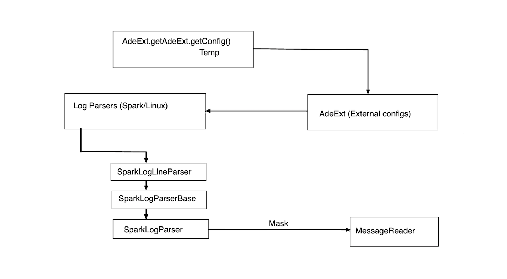
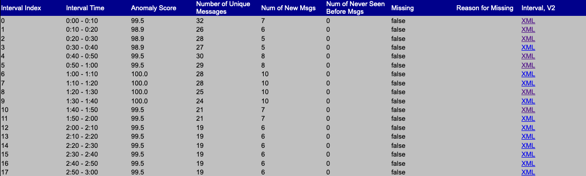
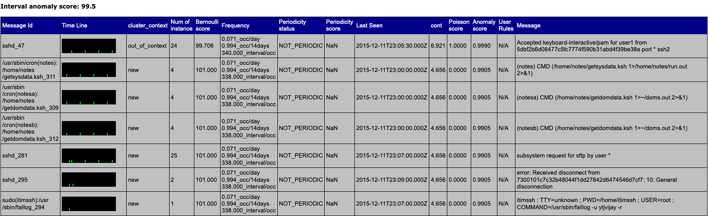

# Introduction

Anomaly detection engine (ADE) is a framework written in Java that detects anomalous time slices and 
messages in Linux and Spark logs using statistical learning. It does so by building a model of the 
expected behavior and then comparing it against the observed behavior for every time period. It
then assigns a few statistically calculates scores: Bernoulli score, Poisson score and an anomaly score
that indicates the chances of the corresponding time slice containing anomalous logs or being the 
cause of unexpected behavior of the system.

At the heart of ADE are unsupervised learning algorithms. Data pipelines extract important features
from the logs messages that are then used to train different model groups. These trained models then
contribute towards calculating the statistical scores. ADE outputs the score and all other relevant 
metadata as an XML file which can then be viewed in the browser. Not only does ADE report the
calculated score for each time interval in the of the entire duration, but it also generates an
internal summary for each interval. This includes the message ids that are generated using
Levenshtein distance to group similar messages together, the corresponding messages, periodicity
status, details about the occurrence of each message and their statistical scores.

# Statement of Need

Anomaly detection is necessary to get to the root of the problem in case a system crashes or
behaves unexpectedly. Such crashes can lead to loss of time and resources. To make things worse,
getting to the bottom of the problem is a tough job: sysadmins typically needs to race against time
and go through hours of log messages to identify the source of the issue. This task becomes 
more difficult when the density of the logs increases, which is very common in Spark or web server
based applications. To make things worse, many applications involve a cluster of machines
working in parallel. Unexpected behavior in a single machine can cause fatal crashes and inaccurate
outputs from the cluster.

Here's where statistical learning steps in. ADE learns what ideal system looks like and
then continuously goes through the generated log messages to produce a report summary for each 
interval of the observed data. The report summary contains various calculated metrics and an 
anomaly score for each interval. Greater anomaly score means that there's a higher chance of the
corresponding interval containing anomalous logs, thus causing unwanted behavior. This makes it
easier to realize the source of the problem, since we now know the time interval during which unexpected
behavior was reported in the system. The task of going through hours of logs messages has been
narrowed down to analysis of analysing just the flagged intervals, since the model is sure that
these have reported unusual messages. In additional, for each interval in the data, ADE produces
a summary of each message seen during the interval. This directly points to the exact message
that might be causing the issue.

There has been a lot of work towards the problem of anomaly detection. TadGAN [@geiger2020tadgan] 
is a generative approach towards solving this problem. Another way to solving
this problem is by using a semi-supervised adversarial learning approach, as done by
_GAN Augmented Text Anomaly Detection with Sequences of Deep Statistics_ [@Fadhel_2019]. Our approach
is very different: we treat this as a statistical problem and avoid introducing computationally
heavy deep learning into the picture. This makes the solution more explainable and faster to
compute.

# Novelties

**ADE is written in the Java language** that makes it ideal to be used across any platform without
changing the underlying code.

**ADE comes batteries-included**: One can just build the binary and invoke required commands to run
ADE on their data.

**Minimal external dependencies**: Most of the functionalities are directly implemented without
 replying on external libraries.

**ADE does not require intensive data labelling** Since ADE uses unsupervised learning algorithms,
it does not require the data to be labelled. Any continious or streaming source of logs directly
serves as the data required to train the model groups.

# Anomaly detection engine (ADE)

## Internals
ADE splits the incoming logs into time slices, called _analysis intervals_ in ADE terminology. The
length of these time slices can be varied depending on the application. Linux logs are generally less
dense than Spark logs and thus have a larger interval size.

Internally, ADE processes these logs and assigns them message id, which is a unique identifier for 
the corresponding message. Message ids are assigned on the basis of Levenshtein distance. This allows
us to assign logs with similar messages the same id, since they are probably going to exhibit similar
behavior.The next step involves training the _model groups_, which are collections of
one or more systems that handle similar type of workloads.

ADE takes into account four major features to measure how unusual an interval is:

- Number of unique message ids
- Interval anomaly score
- Number of messages not in the model
- Number of messages which have not been seen

ADE contains three major submodules: **_ade-core_** contains the core functionalities responsible for
calculating scores, performing unsupervised clustering and modules to deal with input streams. The scores
computed here include _Interval Anomaly score_, _Bernoulli Score_, _Best-of-two score_, _Log normal score_, 
_Poisson score_, _rarity_ and _severity_ scores. We also calculate the critical and unique words for each message that
finally contributes to the score.

**_ade-ext_** is where the data stream parsing happens. It reads parameters specified in the setup file
to invoke the corresponding parsers during runtime. Since each log message has a fixed format, the parsers
use regular expression matching to extract the relevant fields. The logs are _masked_ to remove unnecessary or
sensitive data before sending them to the final _MessageReader_ that sends them directly to the output
stream.

_Internal block diagram of ade-ext_

**_ade-assembly_** contains scripts and metadata files (setup file, template XML files) to run the framework.

For each message, ADE tries to understand if the message was expected or not. This understanding (called the
_context_ of the message) forms a useful indication of the behavior of the system. ADE classifies every message
into four possible _contexts_:

- New : Indicates messages that ADE has never seen before.
- IN_SYNC : Implies that ADE expects the message to be issued in a periodic pattern, and the message was issued
          as expected.
- NOT_IN_SYNC : Implies that ADE expects the message to be issued in a periodic pattern but the message was
          not expected.
- NOT_PERIODIC : Indicates that ADE does not expect the message to be periodic.

## Usage

ADE uses maven package manager and Apache Derby database. Once the binary has been build, ADE
provides various commands to invoke relevant functionalities. 

- `controldb` Contains tools to performs actions on the database. This includes:
  - `create`: Create a database (with properties specified in `setup.props`)
  - `delete`: Delete contents of the database
  - `query "SQL statement"`: Perform the SQL query on the database
  - `dml "SQL statement"`: Issue the SQL statement

- `upload`: Uplooads the directory or compressed file to the database. Intenally, it carries out
    all the logs parsing and preprocessing operations.

- `verify`: Used to verify if the amount of data is sufficient to train the model groups.

- `train`: Trains the model groups. We can additionally specify the model groups to train, 
    else it trains all model groups by default.

- `analyze`: Uses the train models to analyze previously unseen logs. Generates analysis files.

## Output format

ADE outputs the analysis report in XML format. The report contains an analysis summary for the
entire log duration, split on the basis of the interval size. Each interval contains an assigned
anomaly score. For each interval, ADE generates and interval analysis file, also in XML format.
This file gives finer intrinsic analysis information for the interval. This includes details about
each message, periodicity status, frequency, Bernoulli score, Poisson score and anomaly score.

_Example of ADE analysis for a day. Note: Each period has an associated analysis XML file_

_Example of ADE analysis for a period_

# ADE for Spark

Running ADE for Linux or Spark can be toggled externally via the setup file. This stores all
the metadata required to run the commands. If `ade.useSparkLogs=True`, ADE internally invokes
all Spark log parsing and processing functionalities, else it falls back to Linux Syslogs.

# Acknowledgements

We'd like to thank the Open Mainframe Project, Linux Foundation for funding the expansion of
this project to include middleware logs as a part of their internship program. We'd also like
to thank the maintainers and developers of _LogHub_ [@he2020loghub] for providing us high 
quality data to train and test the system.

ADE has been supported by the Open Mainframe Project.

# References
